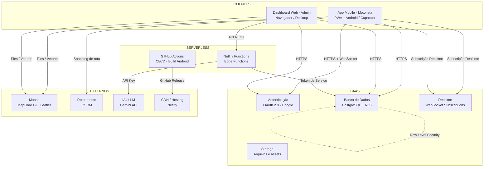
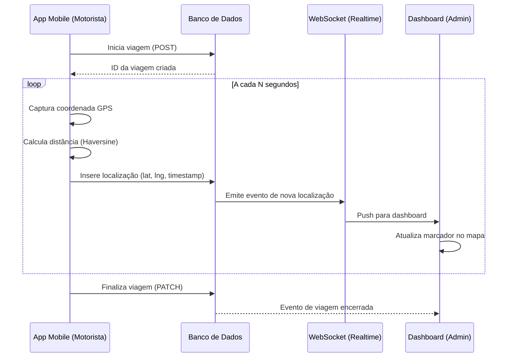

# Arquitetura do Sistema LucaTur

> Documento de alto nível para fins acadêmicos. Não contém URLs, endpoints, credenciais ou configurações reais de produção.

---

## Visão Geral

O LucaTur é uma aplicação full-stack distribuída composta por quatro camadas principais:

1. **Clientes** — Aplicação web administrativa e app mobile para motoristas
2. **Funções Serverless** — Lógica de backend leve sem servidor dedicado
3. **BaaS (Backend-as-a-Service)** — Banco de dados, autenticação e realtime gerenciados
4. **Serviços Externos** — Mapas, roteamento e inteligência artificial

---

## Diagrama de Arquitetura



---

## Camada 1 — Clientes

### Dashboard Web (Administrador)
- Tecnologia: HTML5 + CSS3 + JavaScript puro (sem framework)
- Implantado em CDN estático (Netlify)
- Acesso restrito por autenticação OAuth
- Módulos principais:
  - **Mapa em tempo real**: visualização de frota com atualização via WebSocket
  - **Gestão de motoristas**: cadastro, escalas, notificações
  - **Controle de viagens**: criação, acompanhamento, finalização
  - **Financeiro**: planilhas de custos e receitas
  - **Acessos**: controle de perfis e permissões
  - **Assistente IA**: chat com LLM para consultas operacionais

### App Mobile (Motorista)
- Tecnologia: Progressive Web App (PWA) + Capacitor (Android nativo)
- Instalável via APK ou "Adicionar à tela inicial"
- Funciona em modo offline com sincronização posterior (IndexedDB)
- Rastreamento GPS via API de Geolocalização do navegador/SO
- Build automatizado via GitHub Actions → APK publicado como GitHub Release

---

## Camada 2 — Funções Serverless

Funções de edge executadas sem servidor dedicado:

| Função | Responsabilidade |
|---|---|
| `check-update` | Verifica se há nova versão do APK disponível |
| `download-apk` | Proxy seguro para download do APK |
| `gemini-admin` | Intermediação da API de IA para o painel admin |

Todas as funções recebem credenciais exclusivamente via variáveis de ambiente (nunca hardcoded).

---

## Camada 3 — BaaS (Backend-as-a-Service)

### Banco de Dados (PostgreSQL)
- Hospedado em serviço gerenciado (sem manutenção de infraestrutura)
- **Row Level Security (RLS)**: cada usuário acessa apenas os dados de sua empresa
- Subscriptions realtime via WebSocket para atualizações de mapa e notificações
- Principais entidades do modelo de dados:

```
usuarios        → perfis, roles, empresa vinculada
veiculos        → frota, placa, tipo, status
motoristas      → dados profissionais, vínculo com usuário
viagens         → registro completo de corridas
localizacoes    → histórico GPS por viagem
eventos         → ocorrências operacionais
notificacoes    → alertas para motoristas e admins
custos          → lançamentos financeiros
```

### Autenticação
- OAuth 2.0 com provedor Google
- JWT gerado pelo BaaS e validado em cada requisição
- Controle de acesso por role: `admin`, `motorista`, `gestor`

### Storage
- Armazenamento de arquivos (fotos, documentos, ícones)
- Acesso controlado por políticas de storage semelhantes ao RLS

---

## Camada 4 — Serviços Externos

| Serviço | Uso |
|---|---|
| **MapLibre GL** | Renderização de mapas vetoriais no dashboard |
| **Leaflet** | Mapa alternativo para visualizações específicas |
| **OSRM** | Snap de coordenadas GPS para rodovias (road snapping), cálculo de rotas |
| **Gemini API (LLM)** | Respostas do assistente administrativo por IA |
| **GitHub Actions** | CI/CD para build automático do APK Android |
| **Netlify CDN** | Hosting e distribuição do frontend web |

---

## Fluxo Principal: Rastreamento de Viagem



---

## Segurança

| Mecanismo | Descrição |
|---|---|
| **HTTPS em todas as camadas** | Tráfego sempre criptografado |
| **OAuth 2.0** | Autenticação via provedor confiável (Google) |
| **JWT com expiração** | Tokens de sessão com tempo de vida limitado |
| **Row Level Security** | Isolamento de dados por empresa no banco |
| **Variáveis de ambiente** | Nenhuma credencial no código-fonte |
| **Funções serverless** | Backend sem exposição de infraestrutura |
| **Build CI/CD** | Keystore e segredos apenas no ambiente de build |

---

## Decisões de Arquitetura

| Decisão | Justificativa |
|---|---|
| JavaScript puro no frontend | Zero dependência de framework, bundle pequeno, carregamento rápido em conexões lentas |
| PWA + Capacitor | Um único código para web e Android, sem necessidade de Swift/Kotlin |
| BaaS (sem backend customizado) | Reduz complexidade operacional; RLS substitui API REST proprietária para acesso aos dados |
| Serverless Functions | Backend leve apenas para operações que exigem segredos (tokens de API) |
| OSRM auto-hospedado opcional | Independência de APIs pagas de roteamento para ambientes com orçamento limitado |

---

*Este documento é de uso acadêmico. Nenhum endpoint, URL ou dado de produção está presente.*
